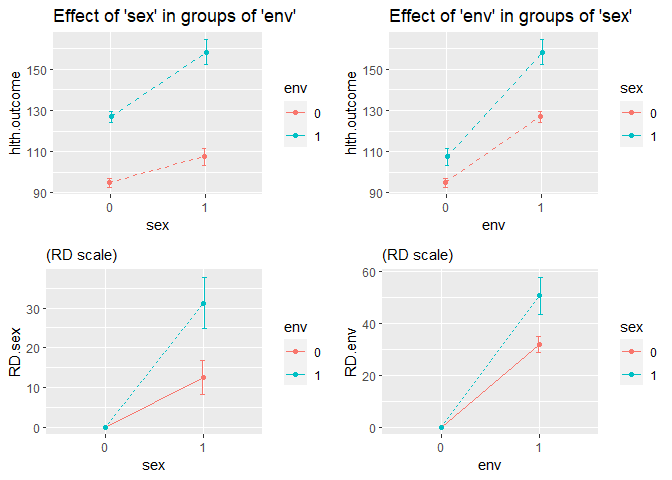

<!-- README.md is generated from README.Rmd. Please edit that file -->

# MargIntTmle

<!-- badges: start -->
<!-- badges: end -->

The goal of MargIntTmle is to estimate marginal interaction effects
using g-computation, IPTW or TMLE. Interaction effects are calculated
from the parameters of a Marginal Structural Model (MSM) estimated using
the [`ltmle`](https://github.com/joshuaschwab/ltmle) R package.

## Installation

You can install the development version of MargIntTmle from
[GitHub](https://github.com/) with:

``` r
# install.packages("devtools")
devtools::install_github("benoitlepage/MargIntTmle")

# in case of error message "ERROR: loading failed for 'i386'"
# use the following command instead
# (which should force it to only build the package for your currently running R version.):
# devtools::install_github("benoitlepage/MargIntTmle", INSTALL_opts=c("--no-multiarch"))
```

## First example, with a binary outcome

In this first example, we simulate a data set of `N` = 1000 rows, with
three baseline confounders (`conf1`, `conf2`, and `conf3`), two
exposures (`sex` and `env`) and one outcome `hlth.outcome`. We used the
default parameters defined in the `param.causal.model()` function.

``` r
require(MargIntTmle)
#> Le chargement a nécessité le package : MargIntTmle
set.seed(12345)
df <- generate.data(N = 1000, b = param.causal.model())
head(df)
#>   conf1 conf2 conf3 sex env hlth.outcome
#> 1     1     0     0   0   0            0
#> 2     1     1     1   1   0            0
#> 3     1     0     1   0   0            0
#> 4     1     0     0   1   0            0
#> 5     0     0     1   0   0            0
#> 6     0     0     0   0   0            0
```

The `int.ltmleMSM` function is used to call the `ltmleMSM` function from
the `ltmle` package, in order to estimate marginal interaction effects
from a Marginal structural model. In this example, we use the TMLE
estimator.

Several quantities of interest are then calculated using the
`estim.int.effects` function.

``` r
require(ltmle)
require(SuperLearner)
# define Q and g formulas following the argument notation of the ltmle package:
Q_formulas = c(hlth.outcome="Q.kplus1 ~ conf1 + conf2 + conf3 + sex * env")
g_formulas = c("sex ~ conf1 + conf2","env ~ conf1 + conf3")
# choose a set of fitting libraries to pass to SuperLearner:
SL.library = list(Q=list("SL.glm"),g=list("SL.glm"))
# apply the int.ltmleMSM function. In order to apply the TMLE and IPTW estimators, 
# gcomp argument is set to FALSE.
interaction.ltmle <- int.ltmleMSM(data = df,
                                  Qform = Q_formulas,
                                  gform = g_formulas,
                                  Anodes = c("sex", "env"),
                                  Lnodes = c("conf1", "conf2", "conf3"),
                                  Ynodes = c("hlth.outcome"),
                                  SL.library = SL.library,
                                  gcomp = FALSE,
                                  iptw.only = FALSE,
                                  survivalOutcome = FALSE,
                                  variance.method = "ic")
# several quantities of interest for interaction effects are calculated using the 
# estim.int.effects() function
est.tmle <- estim.int.effects(interaction.ltmle, estimator = "tmle")
```

The results can be presented in a table following
[`Knol and VanderWeele`](https://doi-org.proxy.insermbiblio.inist.fr/10.1093/ije/dyr218)
recommendations (2012). The out.table object contains the table and the
interaction.effects object contains the additive, multiplicative
interaction effects and the RERI.

The interaction table can be rendered using the `kableExtra` package.

``` r
table_inter <- out.int.table(int.r = est.tmle)
table_inter$out.table
#>                                  A2=0                         A2=1
#> A1=0      $p_{00}$=0.088 [0.06,0.116]  $p_{01}$=0.186 [0.14,0.231]
#> A1=1     $p_{10}$=0.356 [0.269,0.444] $p_{11}$=0.894 [0.776,1.012]
#> RD.A1|A2           0.269 [0.177,0.36]          0.708 [0.582,0.835]
#> RR.A1|A2             4.05 [2.72,6.05]             4.82 [4.54,5.09]
#>                     RD.A2|A1         RR.A2|A1
#> A1=0     0.098 [0.045,0.151] 2.11 [1.42,3.15]
#> A1=1     0.538 [0.391,0.684]  2.51 [1.9,3.32]
#> RD.A1|A2                                     
#> RR.A1|A2
table_inter$interaction.effects
#> [1] "additive Interaction = 0.44 [0.284;0.596]"    
#> [2] "RERI = 5 [3.25;7.7]"                          
#> [3] "multiplicative Interaction = 1.19 [0.73;1.93]"
library(kableExtra)
kbl(table_inter$out.table,
    caption = "Interaction effects estimated by TMLE") %>%
  kable_classic() %>%
  footnote(general = table_inter$interaction.effects)
```

<table class=" lightable-classic" style="font-family: &quot;Arial Narrow&quot;, &quot;Source Sans Pro&quot;, sans-serif; margin-left: auto; margin-right: auto;border-bottom: 0;">
<caption>
Interaction effects estimated by TMLE
</caption>
<thead>
<tr>
<th style="text-align:left;">
</th>
<th style="text-align:left;">
A2=0
</th>
<th style="text-align:left;">
A2=1
</th>
<th style="text-align:left;">
RD.A2\|A1
</th>
<th style="text-align:left;">
RR.A2\|A1
</th>
</tr>
</thead>
<tbody>
<tr>
<td style="text-align:left;">
A1=0
</td>
<td style="text-align:left;">
$p_{00}$=0.088 \[0.06,0.116\]
</td>
<td style="text-align:left;">
$p_{01}$=0.186 \[0.14,0.231\]
</td>
<td style="text-align:left;">
0.098 \[0.045,0.151\]
</td>
<td style="text-align:left;">
2.11 \[1.42,3.15\]
</td>
</tr>
<tr>
<td style="text-align:left;">
A1=1
</td>
<td style="text-align:left;">
$p_{10}$=0.356 \[0.269,0.444\]
</td>
<td style="text-align:left;">
$p_{11}$=0.894 \[0.776,1.012\]
</td>
<td style="text-align:left;">
0.538 \[0.391,0.684\]
</td>
<td style="text-align:left;">
2.51 \[1.9,3.32\]
</td>
</tr>
<tr>
<td style="text-align:left;">
RD.A1\|A2
</td>
<td style="text-align:left;">
0.269 \[0.177,0.36\]
</td>
<td style="text-align:left;">
0.708 \[0.582,0.835\]
</td>
<td style="text-align:left;">
</td>
<td style="text-align:left;">
</td>
</tr>
<tr>
<td style="text-align:left;">
RR.A1\|A2
</td>
<td style="text-align:left;">
4.05 \[2.72,6.05\]
</td>
<td style="text-align:left;">
4.82 \[4.54,5.09\]
</td>
<td style="text-align:left;">
</td>
<td style="text-align:left;">
</td>
</tr>
</tbody>
<tfoot>
<tr>
<td style="padding: 0; " colspan="100%">
<span style="font-style: italic;">Note: </span>
</td>
</tr>
<tr>
<td style="padding: 0; " colspan="100%">
<sup></sup> additive Interaction = 0.44 \[0.284;0.596\]
</td>
</tr>
<tr>
<td style="padding: 0; " colspan="100%">
<sup></sup> RERI = 5 \[3.25;7.7\]
</td>
</tr>
<tr>
<td style="padding: 0; " colspan="100%">
<sup></sup> multiplicative Interaction = 1.19 \[0.73;1.93\]
</td>
</tr>
</tfoot>
</table>

We can also plot the results using the `out.int.fig()` function from the
output of the `estim.int.effects()` function.

``` r
out.int.fig(est.tmle)
```

## Second example, with a continuous outcome

``` r
require(MargIntTmle)
set.seed(54321)
beta <- param.causal.model(Y_type = "continuous", b_Y = 100, b_L1_Y = 10, b_L2_Y = 30,
                           b_L3_Y = -20, b_A1_Y = 10, b_A2_Y = 30, b_A1A2_Y = 20,
                           se_Y = 20)
df.cont.Y <- generate.data(N = 1000, b = beta, Y_type = "continuous")
summary(df.cont.Y)
#>      conf1           conf2           conf3            sex            env       
#>  Min.   :0.000   Min.   :0.000   Min.   :0.000   Min.   :0.00   Min.   :0.000  
#>  1st Qu.:0.000   1st Qu.:0.000   1st Qu.:0.000   1st Qu.:0.00   1st Qu.:0.000  
#>  Median :0.000   Median :0.000   Median :1.000   Median :0.00   Median :0.000  
#>  Mean   :0.483   Mean   :0.185   Mean   :0.702   Mean   :0.21   Mean   :0.375  
#>  3rd Qu.:1.000   3rd Qu.:0.000   3rd Qu.:1.000   3rd Qu.:0.00   3rd Qu.:1.000  
#>  Max.   :1.000   Max.   :1.000   Max.   :1.000   Max.   :1.00   Max.   :1.000  
#>   hlth.outcome   
#>  Min.   : 15.41  
#>  1st Qu.: 87.53  
#>  Median :109.06  
#>  Mean   :111.41  
#>  3rd Qu.:131.82  
#>  Max.   :227.60
```

When using the `int.ltmleMSM`, the `ltmleMSM` function from the `ltmle`
package transforms the outcome on a 0 to 1 scale:

$Z = \frac{Y - \min(Y)}{\max(Y) - \min(Y)}$

The Marginal structural model estimated by the `ltmle` package is a
quasi-binomial regression of $Z$ conditional on the exposures $A_1$ and
$A_2$

$\text{logit} Z = \beta_0 + \beta_{A_1} A_1 + \beta_{A_2} A_2 + \beta_{A_1 \ast A_2} (A_1 \ast A_2)$

``` r
require(ltmle)
require(SuperLearner)
# define Q and g formulas following the argument notation of the ltmle package:
Q_formulas = c(hlth.outcome="Q.kplus1 ~ conf1 + conf2 + conf3 + sex * env")
g_formulas = c("sex ~ conf1 + conf2","env ~ conf1 + conf3")
# choose a set of fitting libraries to pass to SuperLearner:
SL.library = list(Q=list("SL.glm"),g=list("SL.glm"))
# apply the int.ltmleMSM function. In order to apply the TMLE and IPTW estimators, 
# gcomp argument is set to FALSE.
continuous.interaction <- int.ltmleMSM(data = df.cont.Y,
                                       Qform = Q_formulas,
                                       gform = g_formulas,
                                       Anodes = c("sex", "env"),
                                       Lnodes = c("conf1", "conf2", "conf3"),
                                       Ynodes = c("hlth.outcome"),
                                       SL.library = SL.library,
                                       gcomp = FALSE,
                                       iptw.only = FALSE,
                                       survivalOutcome = FALSE,
                                       variance.method = "ic")

# We can see that the outcome has been transformed. 
# The range used to transform the outcome is given in the output
continuous.interaction$ltmle_MSM$transformOutcome
#> [1] TRUE
#> attr(,"Yrange")
#> [1]  15.41274 227.60003
attr(continuous.interaction$ltmle_MSM$transformOutcome, "Yrange")
#> [1]  15.41274 227.60003

# The parameters of the MSM are estimated on the logit scale
continuous.interaction$ltmle_MSM$msm$family
#> 
#> Family: quasibinomial 
#> Link function: logit
# where the coefficients beta_0, beta_A1, beta_A2, and beta_A1_A2 are respectively
continuous.interaction$ltmle_MSM$msm$coefficients
#>         S1         S2         S3         S4 
#> -0.5114610  0.2447366  0.6130341  0.3743373

# several quantities of interest for interaction effects are calculated using the 
# estim.int.effects() function
est.tmle <- estim.int.effects(continuous.interaction, estimator = "tmle")
est.tmle
#> $int.r
#>   A1 A2         p     sd.p     p.lo      p.up    RD.A1 sd.RD.A1  RD.A1.lo
#> 1  0  0  94.95138 16.51346  92.7940  97.10876       NA       NA        NA
#> 2  1  0 107.44079 17.45897 103.4302 111.45134 12.48941 2.221917  8.134537
#> 3  0  1 126.88989 16.76322 124.2430 129.53677       NA       NA        NA
#> 4  1  1 158.16163 18.50580 152.0993 164.22391 31.27174 3.307919 24.788336
#>   RD.A1.up    RD.A2 sd.RD.A2 RD.A2.lo RD.A2.up RR.A1 sd.lnRR.A1 RR.A1.lo
#> 1       NA       NA       NA       NA       NA    NA         NA       NA
#> 2 16.84429       NA       NA       NA       NA    NA         NA       NA
#> 3       NA 31.93851 1.611474 28.78008 35.09694    NA         NA       NA
#> 4 37.75514 50.72084 3.645280 43.57622 57.86545    NA         NA       NA
#>   RR.A1.up RR.A2 sd.lnRR.A2 RR.A2.lo RR.A2.up    a.INT sd.a.INT a.INT.lo
#> 1       NA    NA         NA       NA       NA       NA       NA       NA
#> 2       NA    NA         NA       NA       NA       NA       NA       NA
#> 3       NA    NA         NA       NA       NA       NA       NA       NA
#> 4       NA    NA         NA       NA       NA 18.78232 3.983958 10.97391
#>   a.INT.up RERI sd.lnRERI RERI.lo RERI.up m.INT sd.ln.m.INT m.INT.lo m.INT.up
#> 1       NA   NA        NA      NA      NA    NA          NA       NA       NA
#> 2       NA   NA        NA      NA      NA    NA          NA       NA       NA
#> 3       NA   NA        NA      NA      NA    NA          NA       NA       NA
#> 4 26.59074   NA        NA      NA      NA    NA          NA       NA       NA
#> 
#> $Anodes
#> [1] "sex" "env"
#> 
#> $Ynodes
#> [1] "hlth.outcome"
#> 
#> $transformOutcome
#> [1] TRUE
#> attr(,"Yrange")
#> [1]  15.41274 227.60003
#> 
#> $bootstrap.res
#> NULL
```

The results can be presented in a table showing the mean marginal
outcome under the four potential exposures. The `out.table` object
contains the table and the `interaction.effects` object contains the
additive interaction effects. Relative risks and multiplicative
interaction effects are not shown for quantitative outcomes.

The interaction table can be rendered using the `kableExtra` package.

``` r
table_inter <- out.int.table(int.r = est.tmle)
table_inter$out.table
#>                                       A2=0                               A2=1
#> A1=0       $p_{00}$=94.951 [92.794,97.109]  $p_{01}$=126.89 [124.243,129.537]
#> A1=1     $p_{10}$=107.441 [103.43,111.451] $p_{11}$=158.162 [152.099,164.224]
#> RD.A1|A2             12.489 [8.135,16.844]             31.272 [24.788,37.755]
#>                        RD.A2|A1
#> A1=0      31.939 [28.78,35.097]
#> A1=1     50.721 [43.576,57.865]
#> RD.A1|A2
table_inter$interaction.effects
#> [1] "additive Interaction = 18.782 [10.974;26.591]"
#> [2] "RERI = NA [NA;NA]"                            
#> [3] "multiplicative Interaction = NA [NA;NA]"
library(kableExtra)
kbl(table_inter$out.table,
    caption = "Interaction effects estimated by TMLE") %>%
  kable_classic() %>%
  footnote(general = table_inter$interaction.effects)
```

<table class=" lightable-classic" style="font-family: &quot;Arial Narrow&quot;, &quot;Source Sans Pro&quot;, sans-serif; margin-left: auto; margin-right: auto;border-bottom: 0;">
<caption>
Interaction effects estimated by TMLE
</caption>
<thead>
<tr>
<th style="text-align:left;">
</th>
<th style="text-align:left;">
A2=0
</th>
<th style="text-align:left;">
A2=1
</th>
<th style="text-align:left;">
RD.A2\|A1
</th>
</tr>
</thead>
<tbody>
<tr>
<td style="text-align:left;">
A1=0
</td>
<td style="text-align:left;">
$p_{00}$=94.951 \[92.794,97.109\]
</td>
<td style="text-align:left;">
$p_{01}$=126.89 \[124.243,129.537\]
</td>
<td style="text-align:left;">
31.939 \[28.78,35.097\]
</td>
</tr>
<tr>
<td style="text-align:left;">
A1=1
</td>
<td style="text-align:left;">
$p_{10}$=107.441 \[103.43,111.451\]
</td>
<td style="text-align:left;">
$p_{11}$=158.162 \[152.099,164.224\]
</td>
<td style="text-align:left;">
50.721 \[43.576,57.865\]
</td>
</tr>
<tr>
<td style="text-align:left;">
RD.A1\|A2
</td>
<td style="text-align:left;">
12.489 \[8.135,16.844\]
</td>
<td style="text-align:left;">
31.272 \[24.788,37.755\]
</td>
<td style="text-align:left;">
</td>
</tr>
</tbody>
<tfoot>
<tr>
<td style="padding: 0; " colspan="100%">
<span style="font-style: italic;">Note: </span>
</td>
</tr>
<tr>
<td style="padding: 0; " colspan="100%">
<sup></sup> additive Interaction = 18.782 \[10.974;26.591\]
</td>
</tr>
<tr>
<td style="padding: 0; " colspan="100%">
<sup></sup> RERI = NA \[NA;NA\]
</td>
</tr>
<tr>
<td style="padding: 0; " colspan="100%">
<sup></sup> multiplicative Interaction = NA \[NA;NA\]
</td>
</tr>
</tfoot>
</table>

We can also plot the results using the `out.int.fig()` function from the
output of the `estim.int.effects()` function.

``` r
out.int.fig(est.tmle)
```


